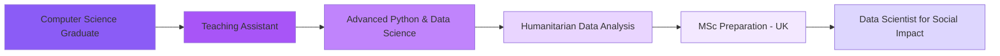

<div align="center">
  
</div>

<h3 align="center">Computer Science Graduate | Teaching Assistant | Aspiring Data Scientist 🇵🇸</h3>

<div align="center">
  
  [](https://www.iugaza.edu.ps/)
  [](https://github.com/Aya-Nabil11)
  [](https://github.com/Aya-Nabil11)
  
</div>

---

## 👩‍💻 About Me

```python
class Aya:
    def __init__(self):
        self.name = "Aya Nabil Alharazin (Ayoosh)"
        self.location = "Gaza, Palestine 🇵🇸"
        self.education = "Computer Science Graduate @ IUG"
        self.role = "Teaching Assistant"
        self.gpa = 95.71
        self.passion = "Data Science for Social & Humanitarian Impact"
        
    def current_work(self):
        return {
            "position": "Teaching Assistant",
            "institution": "Faculty of Information Technology - IUG",
            "courses": ["Python", "Java", "Data Structures", "Operating Systems"]
        }
    
    def currently_learning(self):
        return [
            "Data Science",
            "Advanced Python",
            "NumPy & Pandas",
            "Algorithms",
            "Humanitarian Data Analysis",
            "Evidence-based Reporting"
        ]
    
    def future_goals(self):
        return "MSc in Data Science / Advanced Computer Science (UK) 🎯"
    
    def free_time_activities(self):
        return [
            "Building coding projects 💻",
            "Helping students 🧑‍🏫",
            "Working on humanitarian tech ideas 🌍",
            "Improving English & MSc preparation 📚"
        ]
```

---

## 🛠️ Languages and Tools

### Programming & Data
<div align="left">
  
  
  
  
  
  
  
  
  
  
  
</div>

### Tools & Platforms
<div align="left">
  
  
  
  
  
  
  
  
  
  
  
</div>

### Currently Exploring
<div align="left">
  
  
  
</div>

---

## 📊 GitHub Stats

<div align="center">
  
  
</div>

<div align="center">
  
</div>

<div align="center">
  
</div>

---

## 🔥 What I'm Working On

<div align="center">
  
| 📂 Category | 🎯 Focus |
|------------|---------|
| **Data Structures & Algorithms** | Implementations and teaching materials |
| **Data Science Projects** | NumPy, Pandas, analysis & visualization |
| **University Labs** | Python, Java, OS coursework |
| **Humanitarian Tech** | Gaza-oriented & social impact data projects |
| **Teaching Materials** | Resources for IT students |

</div>

---

## 🌱 Current Learning Path

<div align="center">



</div>

---

## 🎯 My Mission

<div align="center">
  
</div>

---

## 📫 Connect With Me

<div align="center">
  <a href="https://www.youtube.com/@AyaAlharazin" target="_blank">
    
  </a>
  <a href="https://www.instagram.com/alharazinaya/" target="_blank">
    
  </a>
  <a href="https://www.linkedin.com/in/aya-alharazin" target="_blank">
    
  </a>
  <a href="mailto:alharazinaya@gmail.com" target="_blank">
    
  </a>
</div>

---

## 🛠️ Tech Stack & Tools

<div align="center">

### Programming Languages


### Data Science & Analysis


### Development Tools


### Currently Exploring 🌱


</div>

---

<div align="center">

### 🐍 Contribution Snake

<picture>
  <source media="(prefers-color-scheme: dark)" srcset="https://raw.githubusercontent.com/Aya-Nabil11/Aya-Nabil11/output/github-contribution-grid-snake-dark.svg">
  <source media="(prefers-color-scheme: light)" srcset="https://raw.githubusercontent.com/Aya-Nabil11/Aya-Nabil11/output/github-contribution-grid-snake.svg">
  
</picture>

</div>

---

<div align="center">
  
  
  ### ⭐ From [Aya](https://github.com/Aya-Nabil11) with 💜
  
  
</div>
